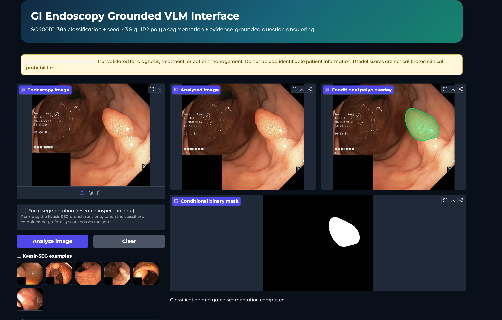
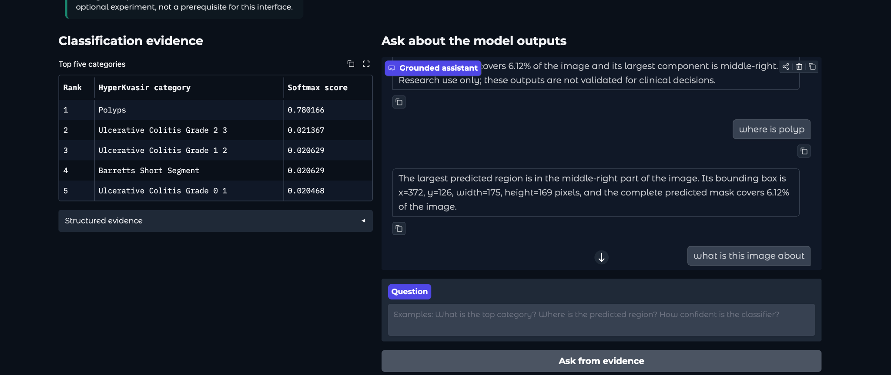

# GI Endoscopy Grounded VLM Interface

A reproducible research interface for gastrointestinal endoscopy images. It combines:

- supervised SigLIP2 SO400M-384 classification over 23 HyperKvasir categories;
- gated SigLIP2 Base NaFlex polyp segmentation;
- deterministic question answering grounded only in the displayed model evidence.

This is a grounded multimodal interface, not an end-to-end generative medical VLM.

Generative Qwen development is isolated on the `qwen-integration` branch. See
[the Qwen integration roadmap](docs/QWEN_INTEGRATION.md) for the leakage-safe
data preparation, native Qwen3-VL baseline, and planned SO400M-to-Qwen bridge.

## Responsible use

This software is a research demonstration. It is not validated for diagnosis,
treatment, patient management, or clinical decision-making. Do not upload
identifiable patient information. Classification softmax scores are not calibrated
clinical probabilities.

## Architecture

    Endoscopy image
           |
           v
    SO400M-384 classifier -----> top-five HyperKvasir scores
           |
           v
    combined polyp-family score >= 0.30?
          / \
        yes  no
        /     \
       v       +-------------> segmentation safely skipped
    seed-43 SigLIP2 polyp segmenter
       |
       v
    mask + overlay + area + bounding box
       |
       v
    structured evidence -----> grounded deterministic Q&A

The two specialist models remain separate because the classification checkpoint is
validated for semantic recognition and the segmentation checkpoint is validated for
pixel localization.

## Checkpoints

Weights are downloaded automatically from Hugging Face on first analysis.
They are never committed to this Git repository.

| Branch | Repository and file | Approximate size |
| --- | --- | ---: |
| Classification | [SO400M seed 42 compact checkpoint](https://huggingface.co/Sahibnoor1/gi-siglip2-dino-hyperkvasir-checkpoints) — checkpoints/siglip2_so400m_384_supervised_v1/seed42/so400m_classifier_seed42_vision_ema.pt | 1.6 GiB |
| Segmentation | [SigLIP2 full seed 43](https://huggingface.co/Sahibnoor1/kvasir-siglip2-segmentation-checkpoints) — checkpoints/siglip2_full/seed_43/best.pt | 388 MB |

For a genuinely one-command public demo, both checkpoint repositories must be public.
If they remain private or gated, users need a Hugging Face read token:

    hf auth login

Alternatively, set the HF_TOKEN environment variable. Never commit a token.

## Hardware and software

Tested configuration:

- Ubuntu Linux;
- Python 3.11;
- PyTorch 2.4.1 with CUDA 12.4;
- Transformers 4.57.6;
- NVIDIA RTX 6000 Ada Generation with 48 GiB VRAM.

An NVIDIA GPU is strongly recommended. Start with at least 16 GiB VRAM; smaller
GPUs have not been validated. CPU execution is available as a fallback but will be
slow. Approximately 5 GiB of free disk space is recommended for dependencies,
model caches, and temporary files.

## Local installation

Clone the repository:

    git clone https://github.com/sahibnoorsingh009/GI-Endoscopy-Grounded-VLM.git
    cd GI-Endoscopy-Grounded-VLM

On Linux or macOS, create the environment and install dependencies:

    bash scripts/setup_local.sh
    source .venv/bin/activate

On Windows PowerShell:

    powershell -ExecutionPolicy Bypass -File scripts/setup_windows.ps1
    .\.venv\Scripts\Activate.ps1

Optionally download both checkpoints before starting:

    python scripts/download_checkpoints.py

Run the interface:

    python app.py

Open http://127.0.0.1:7860 in a browser.

Run the end-to-end smoke test:

    python scripts/smoke_test.py

The first model load can take several minutes because roughly 2 GiB of checkpoint
files must be downloaded and initialized.

## RunPod installation

1. Create one GPU Pod using an official PyTorch template.
2. Enable SSH or Jupyter access.
3. In the Pod template, add 7860 to Expose HTTP Ports.
4. Keep the repository and caches under /workspace so they survive normal Pod restarts.

Inside the Pod:

    cd /workspace
    git clone https://github.com/sahibnoorsingh009/GI-Endoscopy-Grounded-VLM.git
    cd GI-Endoscopy-Grounded-VLM
    bash scripts/setup_runpod.sh
    python scripts/download_checkpoints.py
    python app.py

The public RunPod URL follows this pattern:

    https://POD_ID-7860.proxy.runpod.net

You can print it inside the Pod with:

    echo "https://$RUNPOD_POD_ID-7860.proxy.runpod.net"

The HTTP proxy makes the interface public. For basic access control, set both
variables before launching:

    export VLM_USERNAME=researcher
    export VLM_PASSWORD='use-a-long-random-password'
    python app.py

Stop the Pod when it is not needed to stop GPU billing. Back up /workspace before
terminating any Pod or deleting its persistent volume.

## Configuration

| Environment variable | Default | Purpose |
| --- | --- | --- |
| HF_HOME | Hugging Face default | Model cache root |
| HF_TOKEN | unset | Read access for private or gated checkpoints |
| CLASSIFICATION_CHECKPOINT | auto-download | Local classification checkpoint override |
| SEGMENTATION_CHECKPOINT | auto-download | Local segmentation checkpoint override |
| POLYP_GATE_THRESHOLD | 0.30 | Combined polyp-family gate |
| GRADIO_SERVER_NAME | 0.0.0.0 | Interface bind address |
| GRADIO_SERVER_PORT | 7860 | Interface port |
| VLM_USERNAME | unset | Optional basic-auth username |
| VLM_PASSWORD | unset | Optional basic-auth password |

See [.env.example](.env.example) for a complete template.

## Validated segmentation results

On the fixed 120-image official Kvasir-SEG test split, the seed-43 checkpoint achieved:

| Metric | Value |
| --- | ---: |
| Mean Dice | 0.902960 |
| Mean IoU | 0.847710 |
| Precision | 0.922011 |
| Recall | 0.919619 |
| Failure rate (Dice below 0.10) | 0.000000 |

The deployment uses the same 320 by 320 segmentation geometry as training and maps
the predicted logits back to the uploaded image size. See
[validation details](docs/VALIDATION.md) for the spatial-alignment explanation and
the six-image deployment sanity check.

## Repository structure

    .
    ├── app.py                     # Gradio entry point
    ├── configs/                   # Segmentation configuration
    ├── demo/examples/images/      # Six research examples
    ├── docs/VALIDATION.md         # Metrics and geometry validation
    ├── scripts/                   # Setup, download, checks, smoke test
    ├── src/models/                # Segmentation architecture
    ├── tests/                     # Lightweight repository checks
    └── vlm_demo/                  # UI and two-branch inference service

## Known limitations

- Classification is limited to the 23 HyperKvasir benchmark categories.
- The segmentation model was trained on Kvasir-SEG polyp images and is not a
  validated no-polyp detector.
- The 0.30 classification gate has not yet been clinically calibrated.
- Mask quality can be poor on difficult or out-of-distribution images.
- The Q&A layer summarizes structured evidence; it cannot make unsupported medical claims.
- Performance outside the reported datasets and hardware has not been established.

## Source projects

- [GI-SigLIP2-DINO-HyperKvasir](https://github.com/sahibnoorsingh009/GI-SigLIP2-DINO-HyperKvasir)
- [Kvasir-SigLIP-Segmentation](https://github.com/sahibnoorsingh009/Kvasir-SigLIP-Segmentation)

## License

Code is released under the [Apache License 2.0](LICENSE). Dataset images and
model checkpoints remain subject to their original licenses and terms.
